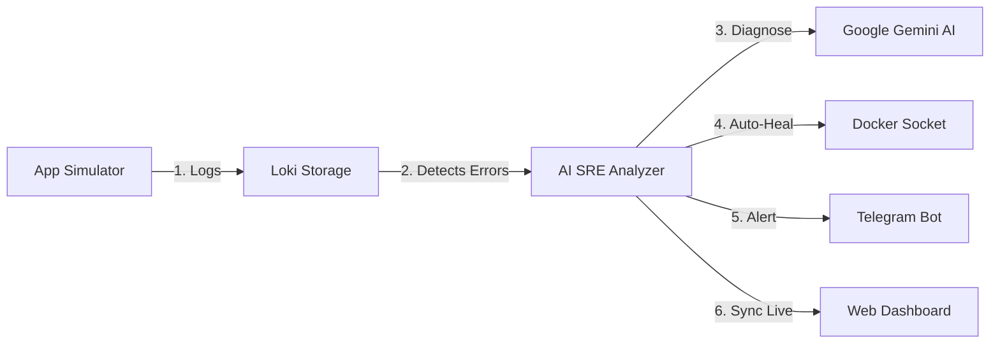

<table width="100%" border="0" cellspacing="0" cellpadding="0" style="border: none; background: transparent;">
  <tr style="border: none; background: transparent;">
    <td width="80" valign="middle" style="border: none; padding-right: 20px;">
      <svg xmlns="http://www.w3.org/2000/svg" viewBox="0 0 24 24" fill="none" stroke="#38bdf8" stroke-width="2" stroke-linecap="round" stroke-linejoin="round" width="80" height="80" style="filter: drop-shadow(0 0 8px #38bdf8);">
        <path d="M12 22s8-4 8-10V5l-8-3-8 3v7c0 6 8 10 8 10z"/>
        <line x1="12" y1="8" x2="12" y2="12"/>
        <line x1="12" y1="16" x2="12.01" y2="16"/>
      </svg>
    </td>
    <td valign="middle" style="border: none;">
      <h1 style="color: #ffffff; font-family: -apple-system, BlinkMacSystemFont, 'Segoe UI', Roboto, Helvetica, Arial, sans-serif; font-size: 42px; font-weight: 800; margin: 0; padding: 0; border: none;">
        Sentinel <span style="color: #9fdaff;">AIOps</span>
      </h1>
      <p style="color: #94a3b8; font-family: -apple-system, BlinkMacSystemFont, 'Segoe UI', Roboto, Helvetica, Arial, sans-serif; font-size: 20px; margin: 5px 0 0 0; padding: 0; font-weight: 500; letter-spacing: -0.5px;">
        Automated SRE Observability & Remediation
      </p>
    </td>
  </tr>
</table>

**Sentinel-AIOps** is a next-generation Observability and Self-Healing platform powered by Artificial Intelligence (AIOps). It goes beyond traditional monitoring by not just telling you *when* an issue occurs, but automatically analyzing *why* it happened using Google's Gemini AI, and proactively executing *Self-Healing* actions (like restarting crashed containers) directly via the host's Docker Socket.

[](https://opensource.org/licenses/MIT)
[](https://www.docker.com/)
[](https://ai.google.dev/)
[](https://nestjs.com/)
[](https://react.dev/)

---

## 🌟 Key Features

- **📊 End-to-End Observability Stack:** Deep integration with Prometheus (Metrics) and Grafana Loki (Logs) for real-time, holistic infrastructure monitoring.
- **🤖 AI Root Cause Analysis (RCA):** Automatically detects critical errors (OOM, Auth Failures, DB Timeouts), extracts contextual logs, and uses advanced Gemini AI models to generate professional SRE root cause analyses.
- **🛠️ Automated Self-Healing:** Connects directly to the host's Docker Daemon Socket (`/var/run/docker.sock`) to execute immediate remediation strategies (e.g., automatically restarting a container that crashed due to an Out of Memory exception).
- **💬 Telegram Alerting & SRE Bot:** Get real-time alerts alongside AI-generated incident reports directly in Telegram, allowing developers to monitor self-healing status on the go.
- **💻 Premium Web Dashboard:** A sleek, modern React UI featuring Dark Mode, real-time metrics charts, AI incident reports, and a dynamic AI Engine configuration panel (hot-swap Gemini models, adjust cooldowns, and edit prompts).
- **⚙️ Dynamic Model Registry & Connectivity Test:** Fetch all active models from your Google API Key dynamically and test connectivity safely using an automated Sandbox fallback mechanism.
- **⚡ Fault Simulator:** A built-in Chaos Engineering simulator to intentionally trigger OOM, High CPU, and Database Timeouts to validate your observability and self-healing pipelines.

---

## 🏗️ System Architecture



### How it Works (Simple Flow):
1. **Logs Generation:** The App Simulator generates system logs as it runs.
2. **Error Detection:** Grafana Loki stores the logs, and the AI SRE Analyzer detects any critical crashes or error patterns.
3. **AI Diagnosis:** The Analyzer extracts the crash traceback and sends it to Google Gemini AI for instant diagnosis.
4. **Self-Healing:** If a service crashed, the Analyzer triggers the local Docker Socket to automatically restart the container.
5. **Notification:** A detailed AI SRE Root Cause Analysis (RCA) is sent to your Telegram Channel.
6. **Real-time Sync:** The incident details and container recovery status are synced live to the Web Dashboard.

---

## 🛠️ Technology Stack

- **Observability:** [Prometheus](https://prometheus.io/), [Grafana Loki](https://grafana.com/oss/loki/), [Grafana](https://grafana.com/).
- **AI Integration:** Google Generative AI (Gemini API v1beta).
- **Backend Service:** NestJS 11 (TypeScript, ESM native, Dockerode API).
- **Frontend Dashboard:** React 18, Vite, Tailwind CSS, Chart.js / Recharts.
- **Infrastructure:** Docker & Docker Compose.

---

## 🚀 Quick Start

### 📋 Prerequisites
- Docker & Docker Compose (v24.0+)
- A valid Google Gemini API Key (Get it free at [Google AI Studio](https://aistudio.google.com/))
- A Telegram Bot Token & Chat ID

### 1. Environment Setup
Copy the `.env.example` file to create your local `.env` file:
```bash
cp .env.example .env
```
Fill in your `GEMINI_API_KEY`, `TELEGRAM_BOT_TOKEN`, and `TELEGRAM_CHAT_ID`.

### 2. Launch the Stack
Start the entire infrastructure pipeline using Docker Compose:
```bash
docker compose up -d --build
```

The services will be exposed on your local machine:
* 🖥️ **Premium Web Dashboard:** `http://localhost:5173`
* ⚙️ **AI Analyzer Service:** `http://localhost:3001`
* 👾 **Fault Simulator:** `http://localhost:8080`
* 📊 **Grafana Dashboard:** `http://localhost:3000` (User: `admin` / Pass: `admin`)
* 📦 **Prometheus:** `http://localhost:9090`
* 🪵 **Loki:** `http://localhost:3100`

---

## 📈 Testing & Verification

Sentinel-AIOps comes with a robust test suite that separates local, rapid unit tests from heavy E2E network-dependent integration tests.

### 🧪 Run Automated Jest Tests
To run the automated tests, navigate to the analyzer directory:
```bash
cd apps/analyzer
```

*   **Run Local Unit Tests (Mock Data, executes instantly):**
    ```bash
    npm run test
    ```
    *Runs pure business logic tests with simulated logs and fake AI endpoints.*

*   **Run Real E2E Integration Tests (Requires real .env keys):**
    ```bash
    npm run test:integration
    ```
    *Executes real Gemini API root-cause generation, checks Loki connectivity, and triggers container restarts via the host's `/var/run/docker.sock`.*

---

## 🖥️ Building, Running & Experiencing the Dashboard

Follow these steps to fully experience the Sentinel-AIOps self-healing pipeline:

### 1. Build and Start the Stack
Initialize the environment configurations and start the Docker Compose orchestration:
```bash
# 1. Initialize environment files
cp .env.example .env
cp apps/dashboard/.env.example apps/dashboard/.env

# 2. Spin up all containers (rebuild if changes were made)
docker compose up -d --build
```

### 2. Access the Dashboard
Once all services are up and running, open your web browser and navigate to:
👉 **[http://localhost:5173](http://localhost:5173)**

The React Premium Web Dashboard offers an immersive, real-time SRE panel featuring:
*   **AIOps Engine Config:** Hot-swap live Gemini models, set custom rate-limit cooldown windows, and edit SRE prompt templates.
*   **Incident Telemetry:** Watch active service states, OOM events, and self-healing action history dynamically.
*   **Active Incidents Log:** Review complete incident analysis reports generated by Gemini.

### 3. Step-by-Step E2E Walkthrough (Experience Self-Healing!)
To watch the automated AI SRE engine take corrective action in real-time, execute this simple E2E verification scenario:

1.  **Configure AIOps Engine:**
    *   On the **Dashboard**, locate the **AIOps Engine Configuration** panel.
    *   Verify or select **Gemini 1.5 Flash Lite (Latest)** (the default, highly optimized model) and ensure **Auto-Healing Mode** is toggled **ON**.
2.  **Trigger Chaos Scenario:**
    *   Navigate to the **Fault Simulator** tab on the Dashboard.
    *   Click **Simulate Out Of Memory (OOM)**.
3.  **Observe Real-time Self-Healing Pipeline:**
    *   **Phase 1 (Crash):** The simulator service immediately crashes. You will see its indicator on the Dashboard switch from Green (Online) to Red (Offline).
    *   **Phase 2 (AI Analysis):** The AI SRE analyzer service detects the `ERR_SYS_OOM` event in Loki logs, extracts contextual tracebacks, and queries Gemini AI.
    *   **Phase 3 (Notification):** Check your Telegram client. You will instantly receive a beautifully structured incident alert complete with a professional Gemini AI Root Cause Analysis (RCA).
    *   **Phase 4 (Remediation):** The NestJS backend communicates with the host `/var/run/docker.sock` and restarts the crashed `sentinel-simulator` container automatically.
    *   **Phase 5 (Resolution):** The Dashboard indicator flips back to Green (Online) and the incident logs status changes to **"Mitigated"** within seconds!

### ⚡ 4. Automated Traffic & Chaos Generator (CLI Option)
Instead of clicking buttons manually, you can use the automated bash script in the `scripts` folder to flood the system with continuous simulated user traffic, slow response times, and dynamic server failures (OOM crashes, database timeouts, authentication failures):

```bash
# 1. Grant execution permission to the script
chmod +x scripts/generate_traffic.sh

# 2. Run the traffic generator
./scripts/generate_traffic.sh
```

**What the script does in real-time:**
*   **50% Normal requests** (`/`) - Generates baseline system metrics.
*   **10% Slow requests** (`/slow`) - Mimics high latencies.
*   **40% Random system failures** (`/error`, `/auth-error`, `/oom-error`, `/rate-limit`) - Simulates sudden chaos events (including process crashes).

*Keep the script running in a separate terminal tab and watch your Promethean metrics spike, Loki logs flood, and the automated AI SRE engine restore the application container instantly!*

---

## 📝 License
Distributed under the MIT License. See `LICENSE` for more information.

---
*Built with ❤️ for fun & entertainment!*